<div align="center">



# Vimar × ABB Showroom

**A cinematic, two-brand electrical products showroom.**

Pick a universe — Vimar's Italian design or ABB's engineered precision — and browse
the catalog in a 3D coverflow. Built by [@WoodbutcherTh1](https://github.com/WoodbutcherTh1)
with Next.js 16, React 19, TypeScript and Tailwind v4, shipped as a static export to GitHub Pages.

**Live:** https://woodbutcherth1.github.io/VimarAbb/

</div>

---

## Highlights

- **Brand landing** — animated video backdrop, floating brand cards, then a full-motion
  transition into the chosen showroom. A logo lockup returns you home from anywhere.
- **Product browsing** — 3D coverflow carousel, sidebar categories, breadcrumb, and a
  detail modal.
- **Price counter** — each price counts up from `0.00` to the real figure, then settles
  into green to mark it final.
- **Add to Quote** — a persistent basket (saved to `localStorage`, synced across tabs)
  that a customer sends to the showroom over WhatsApp, email, or a copied list.
- **Mobile-first** — verified on iPhone SE / 13 and desktop with no horizontal overflow.

## Tech stack

| Layer | Tool |
|-------|------|
| Framework | Next.js 16 (App Router, `output: "export"`) |
| Runtime | React 19 |
| Language | TypeScript 5 |
| Styling | Tailwind CSS 4 |
| Animation | Framer Motion + GSAP |
| Hosting | GitHub Pages (GitHub Actions workflow) |

## Develop

```bash
npm install
npm run dev
```

Open [http://localhost:3000](http://localhost:3000).

## Build

```bash
npm run build      # static export to dist/
```

The GitHub Actions workflow at `.github/workflows/deploy-pages.yml` builds with
`NEXT_PUBLIC_BASE_PATH=/VimarAbb` and publishes `dist/` to Pages on every push to `main`.

## Configuration

Quote destinations live in `src/lib/showroomConfig.ts` — set `whatsappNumber` and `email`
to enable the send buttons on the quote panel (until then, "Copy list" carries the flow).
